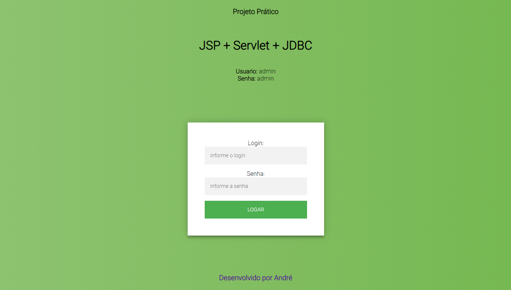
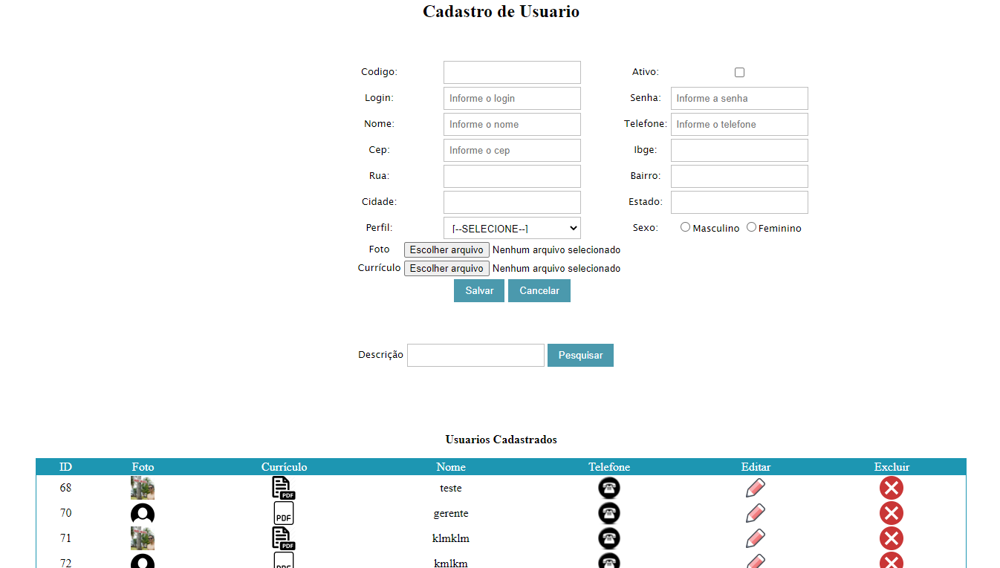

# Projeto Agenda com JSP
> Repositório dedicado ao projeto do curso JDevtreinamento ministrado pelo professor Alex, utilizando as técnologias (JAVA-JSP-SERVLETS).


Tela inicial do sistema


Tela de cadastro de pessoa

## Instalação

Windows:

```sh
Instalar a IDE eclipe disponível em https://www.eclipse.org/downloads/
Clonar o projeto git clone https://https://github.com/andreluis7/Projeto-Jsp.git
Importar projeto no eclipse e executar
```

## Configuração para Desenvolvimento

A aplicação não possui a necessidade de download de dependência para o seu completo funcionamento, apenas baixar e executar.

## Histórico de últimos commits

* (#62) 
    * [Criando o processo de editar a categoria](https://github.com/andreluis7/Projeto-Jsp/commit/4b37fc00aa221611e9e1bef339aba924d3a3fdaf)
* (#61) 
    * [Criando o processo de salvar produto com categoria](https://github.com/andreluis7/Projeto-Jsp/commit/16832f34437dc78501c0159666444b1c078ceca3)
* (#60) 
    * [(Criando o combo na tela tela do usuário](https://github.com/andreluis7/Projeto-Jsp/commit/de3038f1f91087d546df6e43a937229656b513a5)
* (#59) 
    * [Criando consulta dinâmica de usuários](https://github.com/andreluis7/Projeto-Jsp/commit/7af96fc53ad3abce3cc84afd28b6ed19030c7ff2)
* (#58) 
    * [Criando um ComboBox de perfil de usuário](https://github.com/andreluis7/Projeto-Jsp/commit/a3ebc6c8659299f7ae170810c5eee8dc209a75d9)

## Meta

André Luís – [@andreluis7](https://www.linkedin.com/in/andreluis7) – adrluis7@gmail.com

Distribuído sob a licença MIT. Veja `LICENSE` para mais informações.

[https://github.com/andreluis7](https://github.com/andreluis7)

## Contributing

1. Faça o _fork_ do projeto (<https://github.com/andreluis7/Projeto-Jsp/fork>)
2. Crie uma _branch_ para sua modificação (`git checkout -b feature/fooBar`)
3. Faça o _commit_ (`git commit -am 'Add some fooBar'`)
4. _Push_ (`git push origin feature/fooBar`)
5. Crie um novo _Pull Request_

